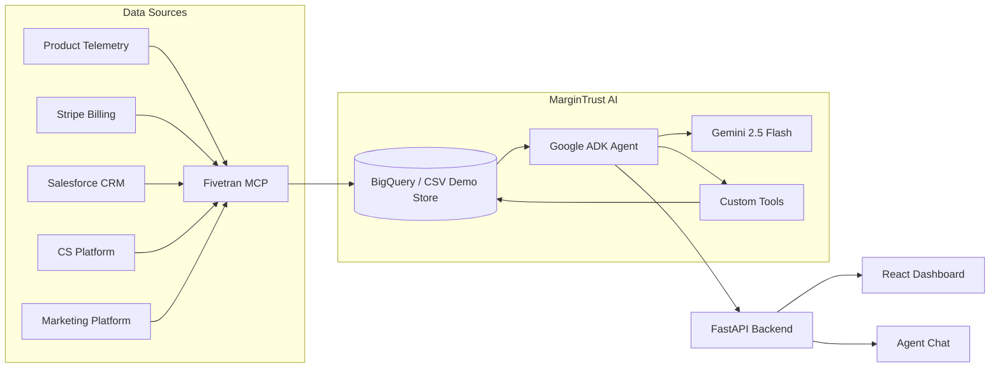

# MarginTrust AI

Gemini-powered revenue leakage detection for usage-based B2B SaaS companies.

MarginTrust AI helps RevOps, Finance, Sales, and Data teams find revenue leaks that sit between systems: usage telemetry, billing, CRM, customer health, marketing spend, and Fivetran connector health. The demo company, StreamWorks Cloud, has synthetic data with three embedded incidents: $126K underbilling exposure, $420K annual expansion gap, and a revenue dashboard trust score of 62/100.

## Architecture



## Tech Stack

| Layer | Technology |
|---|---|
| Agent | Google ADK, Gemini 2.5 Flash, deterministic local fallback |
| Backend | FastAPI, Pydantic, Google BigQuery client |
| Frontend | React, TypeScript, Vite, Tailwind CSS |
| Data | Synthetic CSVs with optional BigQuery load |
| Pipeline | Mock Fivetran MCP server |
| Deployment | Docker, Docker Compose, Cloud Run-ready Dockerfiles |

## Local Setup

Create your local environment file from the root example:

```bash
cp .env.example .env
```

For the default CSV-backed demo, only `GEMINI_API_KEY` is recommended. The app still runs without it by using the deterministic local fallback agent.

| Variable | Required? | Use |
|---|---:|---|
| `GEMINI_API_KEY` | Recommended | Enables the Gemini/Google ADK agent path. Leave blank to use deterministic local responses. |
| `GEMINI_MODEL` | No | Gemini model used by the agent. Defaults to `gemini-2.5-flash`. |
| `BQ_PROJECT_ID` | BigQuery only | Google Cloud project for analytics views and backend reads. Falls back to `GCP_PROJECT_ID`. |
| `GCP_PROJECT_ID` | BigQuery only | Legacy Google Cloud project variable kept for seed-data loads and compatibility. |
| `GCP_REGION` | No | Google Cloud region metadata. Defaults to `us-central1`. |
| `USE_BIGQUERY` | No | Set `true` only after loading the seed CSVs into BigQuery. Defaults to local CSVs. |
| `BQ_RAW_DATASET` | BigQuery only | Raw synthetic dataset containing `accounts`, `contracts`, `product_usage_events`, invoices, connector status, and related tables. Falls back to `BIGQUERY_DATASET`. |
| `BQ_ANALYTICS_DATASET` | BigQuery only | Analytics dataset for generated views. Defaults to `margintrust_analytics`. |
| `BIGQUERY_DATASET` | BigQuery only | Legacy raw dataset name. Defaults to `margintrust`. |
| `GOOGLE_APPLICATION_CREDENTIALS` | BigQuery only | Absolute path to a service-account JSON. Alternatively use `gcloud auth application-default login`. |
| `FIVETRAN_MCP_MODE` | No | Keep `mock` for the POC. `real` is reserved for future Fivetran API integration. |
| `FIVETRAN_API_KEY` / `FIVETRAN_API_SECRET` | Real Fivetran only | Credentials for real Fivetran mode. Not needed for mock mode. |
| `BACKEND_URL` | No | Backend URL for CORS/deployment config. Local default is `http://localhost:8000`. |
| `FRONTEND_URL` | No | Frontend origin allowed by CORS. Local default is `http://localhost:5173`. |

Generate demo data:

```bash
python3 data/generate_seed_data.py
```

The generator writes a larger POC dataset: 750 accounts, 66K+ usage events, 1.6K+ tickets, connector health coverage, and deterministic headline scenarios for underbilling, expansion gaps, duplicate spend, and dashboard trust.
The generator prints progress bars for account synthesis, service-specific table generation, and CSV writes.

Backend:

```bash
cd backend
python3.11 -m venv .venv
. .venv/bin/activate
pip install -r requirements.txt
uvicorn app.main:app --reload --port 8000
```

Frontend:

```bash
cd frontend
npm install
npm run dev
```

Open `http://localhost:5173`.

## Vercel

This repository can deploy as one Vercel project:

- React/Vite frontend is built from `frontend/`, copied to root `dist/`, and served from `/`.
- FastAPI backend is exposed through the Vercel Python function at `/api/*`.
- The default CSV-backed demo runs without BigQuery credentials when `USE_BIGQUERY=false`.

Deploy from the repository root:

```bash
npm install -g vercel
vercel
```

Recommended Vercel environment variables:

| Variable | Required? | Use |
|---|---:|---|
| `GEMINI_API_KEY` | Optional | Enables the Gemini/Google ADK agent path. Without it, the deterministic local fallback responds. |
| `GEMINI_MODEL` | No | Defaults to `gemini-2.5-flash`. |
| `USE_BIGQUERY` | No | Keep `false` for the bundled synthetic CSV demo. Set `true` only after BigQuery datasets and analytics views exist. |
| `BQ_PROJECT_ID` | BigQuery only | Google Cloud project for BigQuery reads. |
| `BQ_RAW_DATASET` | BigQuery only | Raw dataset name. Defaults through `BIGQUERY_DATASET`. |
| `BQ_ANALYTICS_DATASET` | BigQuery only | Analytics views dataset. Defaults to `margintrust_analytics`. |
| `GOOGLE_APPLICATION_CREDENTIALS_JSON` | BigQuery only | Service-account JSON pasted as a Vercel secret. Prefer this over file paths on Vercel. |
| `FRONTEND_URL` | No | Your production URL if you call the API cross-origin. Same-origin `/api` calls do not require it. |

The Vercel build uses `vercel.json`, root `requirements.txt`, root `dist/`, and `api/index.py`. Keep the Vercel project root set to the repository root, not `frontend/` or `backend/`.

## Demo Prompts

- Are we underbilling any enterprise customers this week?
- Which accounts are ready for expansion but missing from CRM pipeline?
- Can I trust the revenue dashboard today?

## BigQuery

Restarting the backend only reads from BigQuery when `USE_BIGQUERY=true`. It does not load or overwrite BigQuery tables or analytics views on startup.

To load the seed CSVs into BigQuery:

1. Enable the BigQuery API in your Google Cloud project.
2. Create or choose a service account.
3. Grant it `BigQuery Job User` and `BigQuery Data Editor` on the project. For a short-lived hackathon project, `BigQuery Admin` also works but is broader than needed.
4. Create a JSON key for the service account and store it outside the repo, for example `~/.config/gcp/margintrust-service-account.json`.
5. Set these values in `.env`:

```bash
BQ_PROJECT_ID=your-gcp-project-id
BQ_RAW_DATASET=margintrust
BQ_ANALYTICS_DATASET=margintrust_analytics
GOOGLE_APPLICATION_CREDENTIALS=/absolute/path/to/margintrust-service-account.json
USE_BIGQUERY=false
```

Then run:

```bash
backend/.venv/bin/python data/load_to_bigquery.py
```

The loader creates the dataset if needed and overwrites the demo tables with the local CSVs. After the load succeeds, set `USE_BIGQUERY=true` and restart the backend.
The loader prints progress bars for BigQuery setup and each table's validate, schema, upload, and verify phases.

Create the analytics layer after the raw seed tables exist:

```bash
backend/.venv/bin/python scripts/create_analytics_views.py --dry-run
backend/.venv/bin/python scripts/create_analytics_views.py
```

The script inspects the raw BigQuery schemas, detects whether the raw opportunity/status tables are named `opportunities`/`fivetran_connector_status` or `crm_opportunities`/`connector_status`, creates the analytics dataset if needed, and builds these synthetic-demo views:

- `underbilling_risk`
- `expansion_gaps`
- `cost_leakage`
- `connector_health`
- `dashboard_trust`
- `executive_overview`

Set `USE_BIGQUERY=true` only after both the raw tables and analytics views exist. The backend dashboard and agent endpoints then read the analytics views, so changing raw BigQuery data and rerunning the view script changes the app outputs.

For local development, you can avoid a service-account key by using Application Default Credentials instead:

```bash
gcloud auth application-default login
```

Then leave `GOOGLE_APPLICATION_CREDENTIALS` blank and keep `BQ_PROJECT_ID` or `GCP_PROJECT_ID` set.

## License

MIT