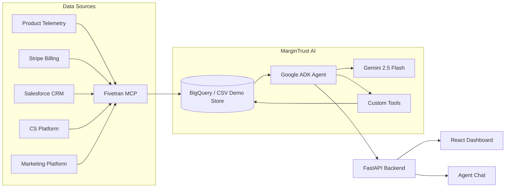

# MarginTrust AI

Gemini-powered revenue leakage detection for usage-based B2B SaaS companies.

MarginTrust AI helps RevOps, Finance, Sales, and Data teams find revenue leaks that sit between systems: usage telemetry, billing, CRM, customer health, marketing spend, and Fivetran connector health. The demo company, StreamWorks Cloud, has synthetic data with three embedded incidents: $126K underbilling exposure, $420K annual expansion gap, and a revenue dashboard trust score of 62/100.

## Architecture



## Tech Stack

| Layer | Technology |
|---|---|
| Agent | Google ADK, Gemini 2.5 Flash, deterministic local fallback |
| Backend | FastAPI, Pydantic, Google BigQuery client |
| Frontend | React, TypeScript, Vite, Tailwind CSS |
| Data | Synthetic CSVs with optional BigQuery load |
| Pipeline | Mock Fivetran MCP server |
| Deployment | Docker, Docker Compose, Cloud Run-ready Dockerfiles |

## Local Setup

Generate demo data:

```bash
python3 data/generate_seed_data.py
```

Backend:

```bash
cd backend
python3.11 -m venv .venv
. .venv/bin/activate
pip install -r requirements.txt
uvicorn app.main:app --reload --port 8000
```

Frontend:

```bash
cd frontend
npm install
npm run dev
```

Open `http://localhost:5173`.

## Demo Prompts

- Are we underbilling any enterprise customers this week?
- Which accounts are ready for expansion but missing from CRM pipeline?
- Can I trust the revenue dashboard today?

## BigQuery

Set `GCP_PROJECT_ID`, `BIGQUERY_DATASET`, and Google application credentials, then run:

```bash
python3 data/load_to_bigquery.py
```

Set `USE_BIGQUERY=true` for the backend to query BigQuery instead of local CSVs.

## License

MIT
