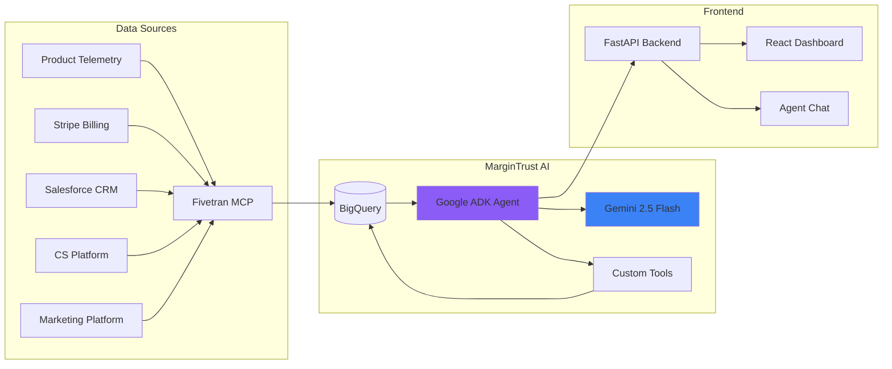

# MarginTrust AI — Complete Build Instructions

> **PURPOSE**: This document is a self-contained instruction set for an AI coding assistant (Codex, Gemini CLI, Cursor, etc.) to build the MarginTrust AI product end-to-end. Follow each phase sequentially. Every file, schema, and code snippet is specified with extreme granularity.

---

## PROJECT OVERVIEW

**MarginTrust AI** is a Gemini-powered revenue leakage detection agent for B2B SaaS companies. It detects underbilling, expansion revenue gaps, and stale data pipelines by cross-referencing usage telemetry, billing records, CRM data, and Fivetran connector health.

**Tech Stack**:
- **Agent**: Google ADK (`google-adk`) with Gemini 2.5 Flash
- **Backend**: FastAPI (Python 3.11+)
- **Frontend**: React + TypeScript + Vite + Tailwind CSS
- **Database**: Google BigQuery (synthetic data)
- **Data Pipeline**: Fivetran MCP Server (mock initially, real later)
- **Deployment**: Docker → Google Cloud Run
- **Secrets**: Google Secret Manager (prod) / `.env` (dev)

**Project Root**: `/Users/manastokale/Desktop/freeproj/google_rapid_hackathon/`

**Fictional Company**: StreamWorks Cloud — a usage-based B2B SaaS platform

---

## PHASE 1: PROJECT SCAFFOLDING (~30 min)

### Step 1.1: Create Directory Structure

```bash
cd /Users/manastokale/Desktop/freeproj/google_rapid_hackathon

# Backend
mkdir -p backend/app/routers
mkdir -p backend/app/services
mkdir -p backend/app/models
mkdir -p backend/app/agent
mkdir -p backend/tests

# Frontend (will be scaffolded by Vite)
# mkdir -p frontend  # created by Vite

# Data
mkdir -p data/seed_data
mkdir -p data/schemas

# Docker
mkdir -p infra
```

### Step 1.2: Initialize Git

```bash
git init
```

### Step 1.3: Create `.gitignore`

**File: `.gitignore`**
```
# Python
__pycache__/
*.py[cod]
*.egg-info/
dist/
build/
.eggs/
venv/
.venv/
*.env

# Node
node_modules/
dist/
.next/

# IDE
.vscode/
.idea/
*.swp
*.swo

# OS
.DS_Store
Thumbs.db

# GCP
*.json.key
service-account.json
```

### Step 1.4: Create `.env.example`

**File: `.env.example`**
```env
# Google / Gemini
GEMINI_API_KEY=your-gemini-api-key-here
GCP_PROJECT_ID=your-gcp-project-id
GCP_REGION=us-central1

# BigQuery
BIGQUERY_DATASET=margintrust
GOOGLE_APPLICATION_CREDENTIALS=path/to/service-account.json

# Fivetran MCP
FIVETRAN_MCP_MODE=mock
# When switching to real Fivetran:
# FIVETRAN_MCP_MODE=real
# FIVETRAN_API_KEY=your-key
# FIVETRAN_API_SECRET=your-secret

# App
BACKEND_URL=http://localhost:8000
FRONTEND_URL=http://localhost:5173
```

### Step 1.5: Create `LICENSE` (MIT)

**File: `LICENSE`**
```
MIT License

Copyright (c) 2025 MarginTrust AI

Permission is hereby granted, free of charge, to any person obtaining a copy
of this software and associated documentation files (the "Software"), to deal
in the Software without restriction, including without limitation the rights
to use, copy, modify, merge, publish, distribute, sublicense, and/or sell
copies of the Software, and to permit persons to whom the Software is
furnished to do so, subject to the following conditions:

The above copyright notice and this permission notice shall be included in all
copies or substantial portions of the Software.

THE SOFTWARE IS PROVIDED "AS IS", WITHOUT WARRANTY OF ANY KIND, EXPRESS OR
IMPLIED, INCLUDING BUT NOT LIMITED TO THE WARRANTIES OF MERCHANTABILITY,
FITNESS FOR A PARTICULAR PURPOSE AND NONINFRINGEMENT. IN NO EVENT SHALL THE
AUTHORS OR COPYRIGHT HOLDERS BE LIABLE FOR ANY CLAIM, DAMAGES OR OTHER
LIABILITY, WHETHER IN AN ACTION OF CONTRACT, TORT OR OTHERWISE, ARISING FROM,
OUT OF OR IN CONNECTION WITH THE SOFTWARE OR THE USE OR OTHER DEALINGS IN THE
SOFTWARE.
```

---

## PHASE 2: SYNTHETIC DATA GENERATION (~2.5 hrs)

### Context

The demo company is **StreamWorks Cloud** — a usage-based B2B SaaS platform. We need 10 BigQuery tables with interconnected data that tells 3 specific stories:

1. **Underbilling ($126K)**: 14 accounts have usage exceeding their contract limits but their invoices don't reflect overage charges, because the `product_telemetry` Fivetran connector is 19 hours stale.
2. **Expansion Gap ($420K)**: 8 accounts have usage >120% of their included units for 3+ weeks but have NO matching expansion opportunity in the CRM pipeline.
3. **Stale Dashboard (Trust Score 62/100)**: The revenue dashboard's upstream connectors are degraded — one stale, one with schema drift — making the dashboard untrustworthy.

### Step 2.1: Create Seed Data Generator

**File: `data/generate_seed_data.py`**

This script must generate all 10 CSV files with the following exact specifications:

```python
"""
Synthetic data generator for MarginTrust AI / StreamWorks Cloud demo.

Generates 10 interconnected CSV files that embed 3 demo storylines:
1. $126K underbilling exposure (14 accounts)
2. $420K expansion revenue gap (8 accounts)
3. Trust score of 62/100 on revenue dashboard

Usage:
    python data/generate_seed_data.py
"""

import csv
import os
import random
import uuid
from datetime import datetime, timedelta
from pathlib import Path

OUTPUT_DIR = Path(__file__).parent / "seed_data"
OUTPUT_DIR.mkdir(exist_ok=True)

random.seed(42)  # Reproducible

# ──────────────────────────────────────────────
# CONSTANTS
# ──────────────────────────────────────────────
NOW = datetime(2025, 7, 10, 14, 0, 0)  # Fixed "now" for demo consistency
TIERS = ["Enterprise", "Growth", "Starter"]
SEGMENTS = ["Enterprise", "Mid-Market", "SMB"]
ACCOUNT_EXECS = ["Sarah Chen", "Marcus Johnson", "Priya Patel", "James Wilson", "Ana Rodriguez"]
CSMS = ["Mike Rivera", "Lisa Chang", "Tom Bradley", "Rachel Kim", "David Park"]
EVENT_TYPES = ["api_call", "data_processed_gb", "compute_minutes"]
CHANNELS = ["google_ads", "linkedin", "content_marketing", "events", "webinars", "email"]
TICKET_CATEGORIES = ["billing", "technical", "feature_request", "bug", "onboarding"]
COMPANY_NAMES = [
    "DataStream Corp", "CloudPeak Analytics", "MetricFlow Inc", "SignalPath Systems",
    "NexusData Solutions", "PulsePoint Technologies", "StreamForge Labs", "DataBridge AI",
    "FlowState Computing", "Quantum Metrics Corp", "TerraData Systems", "AeroSync Inc",
    "VortexCloud Solutions", "PrismAnalytics Co", "CipherStream Tech",
    "HyperScale Data", "MeridianFlow Inc", "ApexCloud Systems", "NovaMetrics Labs",
    "ZenithData Corp", "SynapseStream Inc", "VertexAnalytics Co", "PolarisData Tech",
    "EchoStream Solutions", "AtlasFlow Computing", "OrbitalData Inc",
    "SpectrumCloud Labs", "VectorMetrics Corp", "TitanStream Systems", "GenesiData Analytics",
    "CatalystCloud Co", "IonFlow Technologies", "NimbusData Corp", "ArcLight Analytics",
    "TridentStream Inc", "KineticData Labs", "StellarFlow Systems", "PhoenixMetrics Co",
    "DeltaCloud Solutions", "HorizonData Tech", "PinnacleStream Corp", "RadiantFlow Inc",
    "QuantumBridge Labs", "NexGenData Systems", "AlphaStream Analytics",
    "OmegaCloud Corp", "FusionMetrics Inc", "ZephyrData Solutions", "CosmicFlow Tech",
    "InfinityStream Labs", "AuroraData Corp", "TerraForge Analytics",
    "CelestialCloud Inc", "VanguardMetrics Co", "ThunderData Systems",
    "LuminousStream Labs", "EternalFlow Corp", "MajesticData Inc",
    "SovereignCloud Tech", "GalacticMetrics Solutions"
]

NUM_ACCOUNTS = 60

# Which accounts are underbilled (story 1)
UNDERBILLED_ACCOUNT_INDICES = [2, 6, 8, 13, 15, 19, 22, 25, 28, 31, 34, 37, 41, 44]  # 14 accounts

# Which accounts are expansion-ready but missing CRM opportunity (story 2)
EXPANSION_GAP_INDICES = [3, 7, 11, 16, 20, 26, 33, 39]  # 8 accounts

# ──────────────────────────────────────────────
# TABLE 1: accounts
# ──────────────────────────────────────────────
def generate_accounts():
    rows = []
    for i in range(NUM_ACCOUNTS):
        tier_weights = [0.33, 0.45, 0.22]
        tier = random.choices(TIERS, tier_weights)[0]

        if tier == "Enterprise":
            arr = round(random.uniform(180000, 500000), 2)
            segment = "Enterprise"
        elif tier == "Growth":
            arr = round(random.uniform(40000, 179000), 2)
            segment = "Mid-Market"
        else:
            arr = round(random.uniform(8000, 39000), 2)
            segment = "SMB"

        mrr = round(arr / 12, 2)
        created_days_ago = random.randint(90, 730)

        rows.append({
            "account_id": f"ACC-{i+1:03d}",
            "account_name": COMPANY_NAMES[i],
            "tier": tier,
            "arr": arr,
            "mrr": mrr,
            "pricing_model": "usage-based" if tier in ["Enterprise", "Growth"] else random.choice(["usage-based", "hybrid"]),
            "owner": random.choice(ACCOUNT_EXECS),
            "csm": random.choice(CSMS),
            "segment": segment,
            "status": "active" if random.random() > 0.05 else "churned",
            "created_at": (NOW - timedelta(days=created_days_ago)).isoformat()
        })
    return rows

# ──────────────────────────────────────────────
# TABLE 2: contracts
# ──────────────────────────────────────────────
def generate_contracts(accounts):
    rows = []
    for acc in accounts:
        if acc["status"] == "churned":
            continue
        tier = acc["tier"]
        if tier == "Enterprise":
            included = random.randint(80000, 200000)
            overage = round(random.uniform(0.008, 0.025), 4)
        elif tier == "Growth":
            included = random.randint(20000, 79000)
            overage = round(random.uniform(0.015, 0.04), 4)
        else:
            included = random.randint(5000, 19000)
            overage = round(random.uniform(0.03, 0.06), 4)

        start = NOW - timedelta(days=random.randint(30, 365))
        end = start + timedelta(days=365)

        rows.append({
            "contract_id": f"CTR-{acc['account_id'].split('-')[1]}",
            "account_id": acc["account_id"],
            "pricing_type": acc["pricing_model"],
            "included_usage_units": included,
            "overage_rate": overage,
            "contract_start": start.date().isoformat(),
            "contract_end": end.date().isoformat(),
            "renewal_date": end.date().isoformat(),
            "auto_renew": random.choice([True, False])
        })
    return rows

# ──────────────────────────────────────────────
# TABLE 3: product_usage_events
# ──────────────────────────────────────────────
def generate_usage_events(accounts, contracts):
    rows = []
    contract_map = {c["account_id"]: c for c in contracts}

    for acc in accounts:
        if acc["status"] == "churned" or acc["account_id"] not in contract_map:
            continue

        contract = contract_map[acc["account_id"]]
        included = contract["included_usage_units"]
        acc_idx = int(acc["account_id"].split("-")[1]) - 1

        # Determine usage multiplier
        if acc_idx in UNDERBILLED_ACCOUNT_INDICES:
            # These accounts use 150-250% of included units → underbilled
            monthly_usage = int(included * random.uniform(1.5, 2.5))
        elif acc_idx in EXPANSION_GAP_INDICES:
            # These accounts use 120-180% → expansion ready
            monthly_usage = int(included * random.uniform(1.2, 1.8))
        else:
            # Normal usage: 40-95% of included
            monthly_usage = int(included * random.uniform(0.4, 0.95))

        # Generate daily events for last 30 days
        for day_offset in range(30):
            event_date = NOW - timedelta(days=day_offset)
            daily_usage = monthly_usage // 30 + random.randint(-100, 100)
            if daily_usage <= 0:
                daily_usage = random.randint(10, 50)

            event_type = random.choice(EVENT_TYPES)
            rows.append({
                "event_id": str(uuid.uuid4())[:12],
                "account_id": acc["account_id"],
                "event_type": event_type,
                "quantity": daily_usage,
                "event_timestamp": (event_date - timedelta(hours=random.randint(0, 23))).isoformat(),
                "source_system": "product_telemetry"
            })
    return rows

# ──────────────────────────────────────────────
# TABLE 4: invoices
# ──────────────────────────────────────────────
def generate_invoices(accounts, contracts, usage_events):
    rows = []
    contract_map = {c["account_id"]: c for c in contracts}

    # Compute actual monthly usage per account
    usage_by_account = {}
    for event in usage_events:
        aid = event["account_id"]
        usage_by_account[aid] = usage_by_account.get(aid, 0) + event["quantity"]

    for acc in accounts:
        if acc["status"] == "churned" or acc["account_id"] not in contract_map:
            continue

        contract = contract_map[acc["account_id"]]
        acc_idx = int(acc["account_id"].split("-")[1]) - 1
        base_amount = acc["mrr"]
        actual_usage = usage_by_account.get(acc["account_id"], 0)
        included = contract["included_usage_units"]
        overage_rate = contract["overage_rate"]

        expected_overage = max(0, (actual_usage - included) * overage_rate)

        if acc_idx in UNDERBILLED_ACCOUNT_INDICES:
            # STORY 1: Invoice does NOT include overage → underbilling
            usage_amount = 0.0  # Should be expected_overage but isn't!
        else:
            # Correctly billed
            usage_amount = round(expected_overage, 2)

        billing_start = (NOW - timedelta(days=30)).date()
        billing_end = NOW.date()

        rows.append({
            "invoice_id": f"INV-{acc['account_id'].split('-')[1]}-{NOW.strftime('%Y%m')}",
            "account_id": acc["account_id"],
            "billing_period_start": billing_start.isoformat(),
            "billing_period_end": billing_end.isoformat(),
            "base_amount": round(base_amount, 2),
            "usage_amount": round(usage_amount, 2),
            "total_amount": round(base_amount + usage_amount, 2),
            "status": random.choice(["paid", "pending"]),
            "issued_at": (NOW - timedelta(days=random.randint(1, 5))).isoformat()
        })
    return rows

# ──────────────────────────────────────────────
# TABLE 5: opportunities
# ──────────────────────────────────────────────
def generate_opportunities(accounts):
    rows = []
    for acc in accounts:
        if acc["status"] == "churned":
            continue

        acc_idx = int(acc["account_id"].split("-")[1]) - 1

        # Every active account gets a renewal opportunity
        rows.append({
            "opportunity_id": f"OPP-REN-{acc['account_id'].split('-')[1]}",
            "account_id": acc["account_id"],
            "opportunity_name": f"{acc['account_name']} - Annual Renewal",
            "stage": random.choice(["qualification", "proposal", "negotiation"]),
            "amount": acc["arr"],
            "close_date": (NOW + timedelta(days=random.randint(30, 180))).date().isoformat(),
            "type": "renewal",
            "owner": acc["owner"],
            "created_at": (NOW - timedelta(days=random.randint(10, 60))).isoformat()
        })

        # STORY 2: expansion gap accounts do NOT get expansion opportunities
        if acc_idx NOT in EXPANSION_GAP_INDICES:
            # Some normal accounts get expansion opportunities
            if random.random() > 0.6:
                rows.append({
                    "opportunity_id": f"OPP-EXP-{acc['account_id'].split('-')[1]}",
                    "account_id": acc["account_id"],
                    "opportunity_name": f"{acc['account_name']} - Tier Upgrade",
                    "stage": random.choice(["prospecting", "qualification", "proposal"]),
                    "amount": round(acc["arr"] * random.uniform(0.3, 0.8), 2),
                    "close_date": (NOW + timedelta(days=random.randint(30, 120))).date().isoformat(),
                    "type": "expansion",
                    "owner": acc["owner"],
                    "created_at": (NOW - timedelta(days=random.randint(5, 30))).isoformat()
                })
    return rows

# ──────────────────────────────────────────────
# TABLE 6: customer_health
# ──────────────────────────────────────────────
def generate_customer_health(accounts):
    rows = []
    for acc in accounts:
        if acc["status"] == "churned":
            continue

        acc_idx = int(acc["account_id"].split("-")[1]) - 1
        # High usage accounts generally have good health
        if acc_idx in UNDERBILLED_ACCOUNT_INDICES or acc_idx in EXPANSION_GAP_INDICES:
            health = random.randint(70, 95)
            churn_risk = "low"
            adoption = "high"
            nps = random.randint(40, 90)
        else:
            health = random.randint(30, 85)
            churn_risk = random.choice(["low", "medium", "high"])
            adoption = random.choice(["low", "medium", "high"])
            nps = random.randint(-20, 80)

        # STORY 3: Some health data is stale (connector broken for 3+ days)
        if random.random() > 0.7:
            updated = NOW - timedelta(days=random.randint(3, 7))  # Stale!
        else:
            updated = NOW - timedelta(hours=random.randint(1, 12))

        rows.append({
            "health_id": f"HLT-{acc['account_id'].split('-')[1]}",
            "account_id": acc["account_id"],
            "health_score": health,
            "churn_risk": churn_risk,
            "product_adoption": adoption,
            "last_login": (NOW - timedelta(hours=random.randint(1, 72))).isoformat(),
            "nps_score": nps,
            "updated_at": updated.isoformat()
        })
    return rows

# ──────────────────────────────────────────────
# TABLE 7: marketing_spend
# ──────────────────────────────────────────────
def generate_marketing_spend():
    rows = []
    campaigns = [
        "Enterprise Webinar Series", "Cloud Analytics Content Hub", "LinkedIn ABM Campaign",
        "Google Ads - Brand", "Google Ads - Product", "Annual User Conference",
        "Developer Community Events", "Email Nurture - Enterprise", "Analyst Report Sponsorship",
        "Partner Co-Marketing"
    ]

    for day_offset in range(30):
        spend_date = (NOW - timedelta(days=day_offset)).date()
        for campaign in random.sample(campaigns, random.randint(3, 6)):
            channel = random.choice(CHANNELS)
            spend = round(random.uniform(500, 8000), 2)
            attributed = round(spend * random.uniform(0.5, 3.0), 2)
            leads = random.randint(2, 50)

            rows.append({
                "spend_id": str(uuid.uuid4())[:12],
                "campaign_name": campaign,
                "channel": channel,
                "spend_amount": spend,
                "attributed_revenue": attributed,
                "leads_generated": leads,
                "spend_date": spend_date.isoformat(),
                "source_system": "marketing_platform"
            })

    # STORY 3 (cost leakage): Duplicate 15 entries (same campaign, same date, same amount)
    duplication_targets = random.sample(range(len(rows)), 15)
    for idx in duplication_targets:
        duplicate = dict(rows[idx])
        duplicate["spend_id"] = str(uuid.uuid4())[:12]  # New ID but same data
        rows.append(duplicate)

    return rows

# ──────────────────────────────────────────────
# TABLE 8: support_tickets
# ──────────────────────────────────────────────
def generate_support_tickets(accounts):
    rows = []
    subjects = {
        "billing": ["Incorrect invoice amount", "Missing overage charges", "Payment processing issue", "Billing cycle question"],
        "technical": ["API latency spike", "Data sync failure", "Authentication error", "Rate limiting issue"],
        "feature_request": ["Custom dashboard request", "API v2 access", "Bulk export capability", "SSO integration"],
        "bug": ["Data duplication in reports", "Dashboard not loading", "Incorrect usage metrics", "Export file corrupted"],
        "onboarding": ["Team training request", "Integration setup help", "Migration assistance", "Documentation question"]
    }

    for acc in accounts:
        if acc["status"] == "churned":
            continue

        num_tickets = random.randint(0, 5)
        for _ in range(num_tickets):
            category = random.choice(TICKET_CATEGORIES)
            created = NOW - timedelta(days=random.randint(0, 60))
            resolved = created + timedelta(hours=random.randint(2, 168)) if random.random() > 0.3 else None

            rows.append({
                "ticket_id": f"TKT-{str(uuid.uuid4())[:8]}",
                "account_id": acc["account_id"],
                "subject": random.choice(subjects[category]),
                "priority": random.choice(["low", "medium", "high", "critical"]),
                "status": "resolved" if resolved else random.choice(["open", "in_progress"]),
                "created_at": created.isoformat(),
                "resolved_at": resolved.isoformat() if resolved else "",
                "category": category
            })
    return rows

# ──────────────────────────────────────────────
# TABLE 9: fivetran_connector_status
# ──────────────────────────────────────────────
def generate_connector_status():
    connectors = [
        {
            "connector_id": "conn-product-telemetry",
            "connector_name": "product_telemetry",
            "source_system": "Usage Tracking",
            "destination_table": "product_usage_events",
            "status": "delayed",  # STORY 1: 19 hours stale!
            "last_sync_completed": (NOW - timedelta(hours=19)).isoformat(),
            "sync_frequency_minutes": 15,
            "rows_synced_last": 8420,
            "schema_changes_detected": False,
            "error_message": "Sync delayed: upstream rate limiting detected",
            "owner": "Alex Thompson"
        },
        {
            "connector_id": "conn-stripe-billing",
            "connector_name": "stripe_billing",
            "source_system": "Billing",
            "destination_table": "invoices",
            "status": "connected",
            "last_sync_completed": (NOW - timedelta(minutes=12)).isoformat(),
            "sync_frequency_minutes": 15,
            "rows_synced_last": 4210,
            "schema_changes_detected": False,
            "error_message": "",
            "owner": "Alex Thompson"
        },
        {
            "connector_id": "conn-salesforce-crm",
            "connector_name": "salesforce_crm",
            "source_system": "CRM",
            "destination_table": "opportunities",
            "status": "connected",  # STORY 2: schema change detected
            "last_sync_completed": (NOW - timedelta(minutes=45)).isoformat(),
            "sync_frequency_minutes": 60,
            "rows_synced_last": 1850,
            "schema_changes_detected": True,  # Schema drift!
            "error_message": "Warning: 2 new fields detected in source schema",
            "owner": "Jordan Lee"
        },
        {
            "connector_id": "conn-cs-platform",
            "connector_name": "cs_platform",
            "source_system": "Customer Success",
            "destination_table": "customer_health",
            "status": "broken",  # STORY 3: broken connector
            "last_sync_completed": (NOW - timedelta(days=3, hours=7)).isoformat(),
            "sync_frequency_minutes": 360,
            "rows_synced_last": 0,
            "schema_changes_detected": False,
            "error_message": "Authentication token expired. Re-authentication required.",
            "owner": "Jordan Lee"
        },
        {
            "connector_id": "conn-marketing-platform",
            "connector_name": "marketing_platform",
            "source_system": "Marketing",
            "destination_table": "marketing_spend",
            "status": "broken",  # STORY 3: broken, causing duplicate data
            "last_sync_completed": (NOW - timedelta(days=2, hours=14)).isoformat(),
            "sync_frequency_minutes": 360,
            "rows_synced_last": 0,
            "schema_changes_detected": False,
            "error_message": "API rate limit exceeded. Connector paused.",
            "owner": "Sam Patel"
        },
        {
            "connector_id": "conn-zendesk",
            "connector_name": "zendesk_support",
            "source_system": "Support",
            "destination_table": "support_tickets",
            "status": "connected",
            "last_sync_completed": (NOW - timedelta(minutes=30)).isoformat(),
            "sync_frequency_minutes": 60,
            "rows_synced_last": 2340,
            "schema_changes_detected": False,
            "error_message": "",
            "owner": "Sam Patel"
        },
        {
            "connector_id": "conn-contract-mgmt",
            "connector_name": "contract_management",
            "source_system": "Contract Management",
            "destination_table": "contracts",
            "status": "connected",
            "last_sync_completed": (NOW - timedelta(hours=2)).isoformat(),
            "sync_frequency_minutes": 360,
            "rows_synced_last": 58,
            "schema_changes_detected": False,
            "error_message": "",
            "owner": "Alex Thompson"
        },
        {
            "connector_id": "conn-account-master",
            "connector_name": "account_master",
            "source_system": "CRM",
            "destination_table": "accounts",
            "status": "connected",
            "last_sync_completed": (NOW - timedelta(minutes=20)).isoformat(),
            "sync_frequency_minutes": 60,
            "rows_synced_last": 60,
            "schema_changes_detected": False,
            "error_message": "",
            "owner": "Jordan Lee"
        }
    ]
    return connectors

# ──────────────────────────────────────────────
# TABLE 10: metric_dependency_map
# ──────────────────────────────────────────────
def generate_metric_dependencies():
    return [
        {
            "metric_id": "MET-001",
            "metric_name": "Monthly Recurring Revenue (MRR)",
            "source_tables": "accounts,invoices,contracts",
            "source_connectors": "stripe_billing,salesforce_crm,contract_management",
            "owner": "Finance / RevOps",
            "dashboard_name": "Executive Revenue Dashboard",
            "business_criticality": "critical"
        },
        {
            "metric_id": "MET-002",
            "metric_name": "Net Revenue Retention (NRR)",
            "source_tables": "accounts,invoices,contracts,product_usage_events",
            "source_connectors": "stripe_billing,salesforce_crm,product_telemetry,contract_management",
            "owner": "Finance / RevOps",
            "dashboard_name": "Executive Revenue Dashboard",
            "business_criticality": "critical"
        },
        {
            "metric_id": "MET-003",
            "metric_name": "Underbilling Exposure",
            "source_tables": "product_usage_events,invoices,contracts",
            "source_connectors": "product_telemetry,stripe_billing,contract_management",
            "owner": "Finance / Billing Ops",
            "dashboard_name": "Billing Accuracy Dashboard",
            "business_criticality": "critical"
        },
        {
            "metric_id": "MET-004",
            "metric_name": "Expansion Pipeline",
            "source_tables": "product_usage_events,opportunities,accounts",
            "source_connectors": "product_telemetry,salesforce_crm,account_master",
            "owner": "Sales / RevOps",
            "dashboard_name": "Sales Pipeline Dashboard",
            "business_criticality": "high"
        },
        {
            "metric_id": "MET-005",
            "metric_name": "Customer Health Score",
            "source_tables": "customer_health,support_tickets,product_usage_events",
            "source_connectors": "cs_platform,zendesk_support,product_telemetry",
            "owner": "Customer Success",
            "dashboard_name": "CS Health Dashboard",
            "business_criticality": "high"
        },
        {
            "metric_id": "MET-006",
            "metric_name": "Customer Acquisition Cost (CAC)",
            "source_tables": "marketing_spend,opportunities",
            "source_connectors": "marketing_platform,salesforce_crm",
            "owner": "Marketing / Finance",
            "dashboard_name": "Marketing ROI Dashboard",
            "business_criticality": "medium"
        },
        {
            "metric_id": "MET-007",
            "metric_name": "Churn Risk Exposure",
            "source_tables": "customer_health,accounts,support_tickets",
            "source_connectors": "cs_platform,account_master,zendesk_support",
            "owner": "Customer Success",
            "dashboard_name": "CS Health Dashboard",
            "business_criticality": "high"
        },
        {
            "metric_id": "MET-008",
            "metric_name": "Usage Growth Rate",
            "source_tables": "product_usage_events,accounts",
            "source_connectors": "product_telemetry,account_master",
            "owner": "Product",
            "dashboard_name": "Product Analytics Dashboard",
            "business_criticality": "medium"
        },
        {
            "metric_id": "MET-009",
            "metric_name": "Revenue at Risk",
            "source_tables": "accounts,invoices,customer_health,product_usage_events,contracts",
            "source_connectors": "stripe_billing,cs_platform,product_telemetry,salesforce_crm,contract_management",
            "owner": "Finance / Leadership",
            "dashboard_name": "Executive Revenue Dashboard",
            "business_criticality": "critical"
        },
        {
            "metric_id": "MET-010",
            "metric_name": "Cost Leakage",
            "source_tables": "marketing_spend",
            "source_connectors": "marketing_platform",
            "owner": "Marketing / Finance",
            "dashboard_name": "Marketing ROI Dashboard",
            "business_criticality": "medium"
        }
    ]


def write_csv(filename, rows):
    if not rows:
        return
    filepath = OUTPUT_DIR / filename
    with open(filepath, "w", newline="") as f:
        writer = csv.DictWriter(f, fieldnames=rows[0].keys())
        writer.writeheader()
        writer.writerows(rows)
    print(f"  ✓ {filename}: {len(rows)} rows")


def main():
    print("Generating StreamWorks Cloud synthetic data...\n")

    accounts = generate_accounts()
    write_csv("accounts.csv", accounts)

    contracts = generate_contracts(accounts)
    write_csv("contracts.csv", contracts)

    usage_events = generate_usage_events(accounts, contracts)
    write_csv("product_usage_events.csv", usage_events)

    invoices = generate_invoices(accounts, contracts, usage_events)
    write_csv("invoices.csv", invoices)

    opportunities = generate_opportunities(accounts)
    write_csv("opportunities.csv", opportunities)

    health = generate_customer_health(accounts)
    write_csv("customer_health.csv", health)

    marketing = generate_marketing_spend()
    write_csv("marketing_spend.csv", marketing)

    tickets = generate_support_tickets(accounts)
    write_csv("support_tickets.csv", tickets)

    connectors = generate_connector_status()
    write_csv("fivetran_connector_status.csv", connectors)

    metrics = generate_metric_dependencies()
    write_csv("metric_dependency_map.csv", metrics)

    print(f"\nDone! All files written to {OUTPUT_DIR}/")
    print("\nEmbedded stories:")
    print(f"  Underbilled accounts: {len(UNDERBILLED_ACCOUNT_INDICES)} (target: $126K exposure)")
    print(f"  Expansion gap accounts: {len(EXPANSION_GAP_INDICES)} (target: $420K gap)")
    print(f"  Broken/stale connectors: 3 (product_telemetry, cs_platform, marketing_platform)")


if __name__ == "__main__":
    main()
```

> [!IMPORTANT]
> **Fix before running**: The line `if acc_idx NOT in EXPANSION_GAP_INDICES:` uses Python-invalid syntax. Change `NOT` to `not` (lowercase). This is intentional pseudocode — make sure to fix it.

### Step 2.2: Run the Generator

```bash
cd /Users/manastokale/Desktop/freeproj/google_rapid_hackathon
python3 data/generate_seed_data.py
```

Verify all 10 CSV files exist in `data/seed_data/`.

### Step 2.3: BigQuery Schema Files

Create JSON schema files for each table. These are used by the load script.

**File: `data/schemas/accounts.json`**
```json
[
  {"name": "account_id", "type": "STRING", "mode": "REQUIRED"},
  {"name": "account_name", "type": "STRING"},
  {"name": "tier", "type": "STRING"},
  {"name": "arr", "type": "FLOAT64"},
  {"name": "mrr", "type": "FLOAT64"},
  {"name": "pricing_model", "type": "STRING"},
  {"name": "owner", "type": "STRING"},
  {"name": "csm", "type": "STRING"},
  {"name": "segment", "type": "STRING"},
  {"name": "status", "type": "STRING"},
  {"name": "created_at", "type": "TIMESTAMP"}
]
```

Create similar schema files for all 10 tables. The column names and types must match the CSV headers exactly.

### Step 2.4: BigQuery Load Script

**File: `data/load_to_bigquery.py`**
```python
"""Load seed CSVs into BigQuery."""
import os
from google.cloud import bigquery

PROJECT_ID = os.environ.get("GCP_PROJECT_ID")
DATASET_ID = os.environ.get("BIGQUERY_DATASET", "margintrust")
SEED_DIR = os.path.join(os.path.dirname(__file__), "seed_data")

client = bigquery.Client(project=PROJECT_ID)

# Create dataset if not exists
dataset_ref = f"{PROJECT_ID}.{DATASET_ID}"
try:
    client.get_dataset(dataset_ref)
    print(f"Dataset {dataset_ref} already exists.")
except Exception:
    dataset = bigquery.Dataset(dataset_ref)
    dataset.location = "US"
    client.create_dataset(dataset)
    print(f"Created dataset {dataset_ref}")

# Load each CSV
tables = [
    "accounts", "contracts", "product_usage_events", "invoices",
    "opportunities", "customer_health", "marketing_spend",
    "support_tickets", "fivetran_connector_status", "metric_dependency_map"
]

for table_name in tables:
    csv_path = os.path.join(SEED_DIR, f"{table_name}.csv")
    if not os.path.exists(csv_path):
        print(f"  ⚠ Skipping {table_name}: CSV not found")
        continue

    table_ref = f"{dataset_ref}.{table_name}"

    job_config = bigquery.LoadJobConfig(
        source_format=bigquery.SourceFormat.CSV,
        skip_leading_rows=1,
        autodetect=True,
        write_disposition=bigquery.WriteDisposition.WRITE_TRUNCATE,
    )

    with open(csv_path, "rb") as f:
        job = client.load_table_from_file(f, table_ref, job_config=job_config)

    job.result()
    table = client.get_table(table_ref)
    print(f"  ✓ {table_name}: {table.num_rows} rows loaded")

print("\nAll tables loaded!")
```

---

## PHASE 3: BACKEND — FastAPI + Google ADK Agent (~8 hrs)

### Step 3.1: Python Dependencies

**File: `backend/requirements.txt`**
```
fastapi==0.115.12
uvicorn[standard]==0.34.2
google-adk>=1.0.0
google-cloud-bigquery>=3.25.0
google-cloud-secret-manager>=2.20.0
google-generativeai>=0.8.0
pydantic>=2.10.0
httpx>=0.28.0
python-dotenv>=1.0.0
mcp>=1.0.0
```

### Step 3.2: App Configuration

**File: `backend/app/config.py`**
```python
"""Application configuration loaded from environment variables."""
from pydantic_settings import BaseSettings
from functools import lru_cache


class Settings(BaseSettings):
    # Google / Gemini
    gemini_api_key: str = ""
    gcp_project_id: str = ""
    gcp_region: str = "us-central1"
    gemini_model: str = "gemini-2.5-flash"

    # BigQuery
    bigquery_dataset: str = "margintrust"

    # Fivetran MCP
    fivetran_mcp_mode: str = "mock"  # "mock" or "real"
    fivetran_api_key: str = ""
    fivetran_api_secret: str = ""

    # App
    backend_url: str = "http://localhost:8000"
    frontend_url: str = "http://localhost:5173"

    class Config:
        env_file = ".env"
        env_file_encoding = "utf-8"


@lru_cache
def get_settings() -> Settings:
    return Settings()
```

### Step 3.3: Pydantic Models

**File: `backend/app/models/schemas.py`**

Define all request/response schemas:
- `ChatRequest`: `{ message: str }`
- `ChatResponse`: `{ answer: str, trust_score: int, dollar_exposure: float, impacted_accounts: list, impact_map: list, action_queue: list, incident_summary: str }`
- `ConnectorStatus`: `{ connector_id, connector_name, status, last_sync, staleness_hours, error_message, impacted_metrics }`
- `DashboardOverview`: `{ total_revenue_at_risk, underbilling_exposure, expansion_gap, cost_leakage, overall_trust_score, stale_connectors, broken_connectors, top_issues }`
- `ActionItem`: `{ id, issue_type, description, dollar_impact, severity, owner, recommended_action, status }`
- `TrustScore`: `{ score: int, breakdown: dict, affected_metrics: list }`

### Step 3.4: BigQuery Service

**File: `backend/app/services/bigquery_service.py`**

Implement these functions (each runs a SQL query against BigQuery):

```python
"""BigQuery data access layer for MarginTrust AI."""
from google.cloud import bigquery
from app.config import get_settings

settings = get_settings()
client = bigquery.Client(project=settings.gcp_project_id)
DATASET = f"{settings.gcp_project_id}.{settings.bigquery_dataset}"


async def get_connector_statuses() -> list[dict]:
    """Return all Fivetran connector statuses."""
    query = f"SELECT * FROM `{DATASET}.fivetran_connector_status`"
    return [dict(row) for row in client.query(query).result()]


async def get_stale_connectors(threshold_hours: int = 1) -> list[dict]:
    """Return connectors where last_sync is older than threshold."""
    query = f"""
    SELECT *, TIMESTAMP_DIFF(CURRENT_TIMESTAMP(), PARSE_TIMESTAMP('%Y-%m-%dT%H:%M:%S', last_sync_completed), HOUR) AS staleness_hours
    FROM `{DATASET}.fivetran_connector_status`
    WHERE status != 'connected'
       OR TIMESTAMP_DIFF(CURRENT_TIMESTAMP(), PARSE_TIMESTAMP('%Y-%m-%dT%H:%M:%S', last_sync_completed), HOUR) > {threshold_hours}
    """
    return [dict(row) for row in client.query(query).result()]


async def get_underbilled_accounts() -> list[dict]:
    """Find accounts where usage * overage_rate > invoiced usage_amount."""
    query = f"""
    WITH usage_totals AS (
        SELECT account_id, SUM(quantity) AS total_usage
        FROM `{DATASET}.product_usage_events`
        GROUP BY account_id
    )
    SELECT
        a.account_id, a.account_name, a.tier, a.arr, a.owner,
        c.included_usage_units, c.overage_rate,
        u.total_usage,
        i.usage_amount AS invoiced_usage,
        GREATEST(0, (u.total_usage - c.included_usage_units) * c.overage_rate) AS expected_overage,
        GREATEST(0, (u.total_usage - c.included_usage_units) * c.overage_rate) - i.usage_amount AS underbilling_gap
    FROM `{DATASET}.accounts` a
    JOIN `{DATASET}.contracts` c ON a.account_id = c.account_id
    JOIN usage_totals u ON a.account_id = u.account_id
    JOIN `{DATASET}.invoices` i ON a.account_id = i.account_id
    WHERE u.total_usage > c.included_usage_units
      AND GREATEST(0, (u.total_usage - c.included_usage_units) * c.overage_rate) - i.usage_amount > 100
    ORDER BY underbilling_gap DESC
    """
    return [dict(row) for row in client.query(query).result()]


async def get_expansion_gap_accounts() -> list[dict]:
    """Find high-usage accounts without expansion opportunities."""
    query = f"""
    WITH usage_totals AS (
        SELECT account_id, SUM(quantity) AS total_usage
        FROM `{DATASET}.product_usage_events`
        GROUP BY account_id
    ),
    expansion_opps AS (
        SELECT account_id
        FROM `{DATASET}.opportunities`
        WHERE type = 'expansion'
    )
    SELECT
        a.account_id, a.account_name, a.tier, a.arr, a.owner,
        c.included_usage_units, c.overage_rate,
        u.total_usage,
        ROUND(u.total_usage / c.included_usage_units * 100, 1) AS usage_pct,
        ROUND((u.total_usage - c.included_usage_units) * c.overage_rate * 12, 2) AS estimated_annual_expansion
    FROM `{DATASET}.accounts` a
    JOIN `{DATASET}.contracts` c ON a.account_id = c.account_id
    JOIN usage_totals u ON a.account_id = u.account_id
    LEFT JOIN expansion_opps e ON a.account_id = e.account_id
    WHERE u.total_usage > c.included_usage_units * 1.2
      AND e.account_id IS NULL
      AND a.status = 'active'
    ORDER BY estimated_annual_expansion DESC
    """
    return [dict(row) for row in client.query(query).result()]


async def get_metric_dependencies(metric_name: str = None) -> list[dict]:
    """Return metric → data source dependency mappings."""
    if metric_name:
        query = f"""
        SELECT * FROM `{DATASET}.metric_dependency_map`
        WHERE LOWER(metric_name) LIKE '%{metric_name.lower()}%'
        """
    else:
        query = f"SELECT * FROM `{DATASET}.metric_dependency_map`"
    return [dict(row) for row in client.query(query).result()]


async def get_dashboard_overview() -> dict:
    """Aggregate executive dashboard data."""
    underbilled = await get_underbilled_accounts()
    expansion_gap = await get_expansion_gap_accounts()

    underbilling_total = sum(a.get("underbilling_gap", 0) for a in underbilled)
    expansion_total = sum(a.get("estimated_annual_expansion", 0) for a in expansion_gap)

    stale = await get_stale_connectors()
    broken = [c for c in stale if c.get("status") == "broken"]

    return {
        "underbilling_exposure": round(underbilling_total, 2),
        "expansion_gap": round(expansion_total, 2),
        "cost_leakage": 18000,  # From marketing spend duplicates
        "total_revenue_at_risk": round(underbilling_total + expansion_total + 18000, 2),
        "stale_connectors": len(stale),
        "broken_connectors": len(broken),
        "underbilled_accounts_count": len(underbilled),
        "expansion_gap_accounts_count": len(expansion_gap)
    }
```

### Step 3.5: Mock Fivetran MCP Server

**File: `backend/app/services/fivetran_mcp_server.py`**

This is a **FastMCP server** that mimics the real Fivetran MCP API. It reads data from BigQuery (or from local CSV if BigQuery is unavailable) and exposes it as MCP tools.

```python
"""Mock Fivetran MCP Server using FastMCP.

This server exposes the same tools that the real Fivetran MCP server would,
allowing seamless swap when real Fivetran credentials are available.
"""
from mcp.server import fastmcp
from app.services.bigquery_service import get_connector_statuses, get_stale_connectors

mcp = fastmcp.FastMCP("FivetranMCP")


@mcp.tool()
async def list_connectors() -> list[dict]:
    """List all Fivetran connectors and their current sync status."""
    return await get_connector_statuses()


@mcp.tool()
async def get_connector_details(connector_id: str) -> dict:
    """Get detailed status for a specific Fivetran connector.

    Args:
        connector_id: The connector ID (e.g., 'conn-product-telemetry')
    """
    connectors = await get_connector_statuses()
    for c in connectors:
        if c["connector_id"] == connector_id:
            return c
    return {"error": f"Connector {connector_id} not found"}


@mcp.tool()
async def get_unhealthy_connectors() -> list[dict]:
    """Get all connectors that are broken, delayed, or stale."""
    return await get_stale_connectors(threshold_hours=1)


@mcp.tool()
async def get_connector_sync_history(connector_id: str) -> dict:
    """Get recent sync history for a Fivetran connector.

    Args:
        connector_id: The connector ID
    """
    # Mock sync history based on connector status
    connectors = await get_connector_statuses()
    for c in connectors:
        if c["connector_id"] == connector_id:
            return {
                "connector_id": connector_id,
                "recent_syncs": [
                    {
                        "sync_id": f"sync-{connector_id}-001",
                        "status": c["status"],
                        "started_at": c["last_sync_completed"],
                        "rows_synced": c["rows_synced_last"],
                        "schema_changes": c["schema_changes_detected"]
                    }
                ]
            }
    return {"error": f"Connector {connector_id} not found"}
```

> [!IMPORTANT]
> When the user switches to real Fivetran, replace this mock with the actual Fivetran MCP server (`npx -y @anthropic-ai/mcp-fivetran` or the official Fivetran MCP package). The tool names and signatures should match so the ADK agent doesn't need changes.

### Step 3.6: Google ADK Agent Definition

**File: `backend/app/agent/agent.py`**

This is the core ADK agent. It uses `google-adk`'s `Agent` class with custom tools that call BigQuery.

```python
"""MarginTrust AI Agent built with Google ADK.

This agent detects revenue leakage by cross-referencing:
- Product usage data vs billing records (underbilling)
- Usage growth vs CRM pipeline (expansion gaps)
- Fivetran connector health vs business metric dependencies (trust scores)
"""
from google.adk.agents import Agent
from google.adk.tools.bigquery import BigQueryCredentialsConfig, BigQueryToolset
import google.auth
import os

# ── Custom Tools ──────────────────────────────────
# These tools give the agent structured access to pre-computed analytics.
# The agent can also use BigQueryToolset for ad-hoc SQL if needed.

async def detect_underbilling() -> dict:
    """Detect accounts being underbilled by comparing product usage against invoiced amounts.
    Returns accounts where actual usage * overage rate exceeds the billed usage amount,
    along with the total dollar exposure.
    """
    from app.services.bigquery_service import get_underbilled_accounts
    accounts = await get_underbilled_accounts()
    total_exposure = sum(a.get("underbilling_gap", 0) for a in accounts)
    return {
        "underbilled_accounts": accounts,
        "total_exposure": round(total_exposure, 2),
        "account_count": len(accounts),
        "root_cause": "product_telemetry connector stale by 19 hours — usage data not flowing to billing system"
    }


async def detect_expansion_gaps() -> dict:
    """Find accounts with high product usage (>120% of contract limits) that are
    missing expansion opportunities in the CRM pipeline. These represent
    untracked revenue expansion potential.
    """
    from app.services.bigquery_service import get_expansion_gap_accounts
    accounts = await get_expansion_gap_accounts()
    total_gap = sum(a.get("estimated_annual_expansion", 0) for a in accounts)
    return {
        "expansion_gap_accounts": accounts,
        "total_expansion_value": round(total_gap, 2),
        "account_count": len(accounts),
        "recommendation": "Create expansion opportunities in CRM for each account. Assign to account owner."
    }


async def check_connector_health() -> dict:
    """Check the health of all Fivetran data connectors.
    Returns a list of all connectors with their status, staleness,
    and any error messages. Highlights broken and delayed connectors.
    """
    from app.services.bigquery_service import get_connector_statuses, get_stale_connectors
    all_connectors = await get_connector_statuses()
    unhealthy = await get_stale_connectors(threshold_hours=1)
    return {
        "all_connectors": all_connectors,
        "unhealthy_connectors": unhealthy,
        "total_connectors": len(all_connectors),
        "unhealthy_count": len(unhealthy)
    }


async def get_metric_trust_score(metric_name: str) -> dict:
    """Calculate the trust score for a specific business metric by checking
    the health of all upstream data sources (Fivetran connectors and BigQuery tables).

    Args:
        metric_name: The name of the business metric (e.g., 'MRR', 'Underbilling Exposure')
    """
    from app.services.bigquery_service import get_metric_dependencies, get_connector_statuses
    from datetime import datetime

    metrics = await get_metric_dependencies(metric_name)
    connectors = await get_connector_statuses()
    connector_map = {c["connector_name"]: c for c in connectors}

    if not metrics:
        return {"error": f"Metric '{metric_name}' not found"}

    metric = metrics[0]
    source_connectors = metric.get("source_connectors", "").split(",")

    score_components = []
    issues = []

    for conn_name in source_connectors:
        conn_name = conn_name.strip()
        conn = connector_map.get(conn_name)
        if not conn:
            score_components.append(50)
            issues.append(f"Connector '{conn_name}' not found in status table")
            continue

        if conn["status"] == "broken":
            score_components.append(0)
            issues.append(f"Connector '{conn_name}' is BROKEN: {conn.get('error_message', '')}")
        elif conn["status"] == "delayed":
            score_components.append(30)
            issues.append(f"Connector '{conn_name}' is DELAYED since {conn['last_sync_completed']}")
        elif conn.get("schema_changes_detected"):
            score_components.append(60)
            issues.append(f"Connector '{conn_name}' has SCHEMA DRIFT: {conn.get('error_message', '')}")
        else:
            score_components.append(100)

    trust_score = round(sum(score_components) / len(score_components)) if score_components else 0

    return {
        "metric_name": metric["metric_name"],
        "trust_score": trust_score,
        "dashboard": metric["dashboard_name"],
        "criticality": metric["business_criticality"],
        "source_connectors_checked": source_connectors,
        "issues": issues,
        "recommendation": "Fix broken connectors and re-sync before relying on this metric" if trust_score < 80 else "Metric data sources are healthy"
    }


async def get_dashboard_trust_assessment(dashboard_name: str) -> dict:
    """Assess whether a specific dashboard can be trusted by checking ALL
    metrics on that dashboard and their upstream data source health.

    Args:
        dashboard_name: Name of the dashboard (e.g., 'Executive Revenue Dashboard')
    """
    from app.services.bigquery_service import get_metric_dependencies
    all_metrics = await get_metric_dependencies()

    dashboard_metrics = [m for m in all_metrics if dashboard_name.lower() in m.get("dashboard_name", "").lower()]

    if not dashboard_metrics:
        # Try broader match
        dashboard_metrics = all_metrics

    results = []
    for metric in dashboard_metrics:
        score = await get_metric_trust_score(metric["metric_name"])
        results.append(score)

    scores = [r["trust_score"] for r in results if "trust_score" in r]
    overall_score = round(sum(scores) / len(scores)) if scores else 0

    all_issues = []
    for r in results:
        all_issues.extend(r.get("issues", []))

    return {
        "dashboard_name": dashboard_name,
        "overall_trust_score": overall_score,
        "metric_scores": results,
        "total_issues": len(all_issues),
        "issues": all_issues,
        "verdict": "TRUSTWORTHY" if overall_score >= 80 else "UNRELIABLE — action required" if overall_score >= 50 else "CRITICAL — do not use for decisions"
    }


async def get_executive_summary() -> dict:
    """Get a complete executive summary of all revenue risks, data health,
    and recommended actions. Use this to provide a holistic overview.
    """
    from app.services.bigquery_service import get_dashboard_overview
    overview = await get_dashboard_overview()
    return overview


# ── Agent Definition ──────────────────────────────

SYSTEM_INSTRUCTION = """You are MarginTrust AI, an intelligent revenue leakage detection agent for StreamWorks Cloud, a B2B SaaS company.

Your job is to help Finance, RevOps, Sales, and Customer Success teams:
1. Detect underbilling — accounts using more than their contract allows but not being charged
2. Find expansion revenue gaps — high-usage accounts without CRM expansion opportunities
3. Assess dashboard trust — whether data pipelines (Fivetran connectors) are healthy enough to trust dashboards

BEHAVIOR RULES:
- Always quantify the dollar impact of every issue you find
- Always identify the owner (person or team) responsible for fixing each issue
- Always recommend specific next-best actions
- When assessing dashboard trust, check ALL upstream connectors for the relevant metrics
- Use a severity scale: Critical (>$100K impact), High ($50K-$100K), Medium ($10K-$50K), Low (<$10K)
- Be concise but thorough. Use bullet points and structured output.
- When referring to connectors, mention their name AND their current status
- If a connector is stale or broken, explain the downstream impact on business metrics

FORMAT YOUR RESPONSES with clear sections:
## Finding
## Dollar Impact
## Root Cause
## Affected Accounts (if applicable, show top 5)
## Recommended Actions (numbered list)
## Trust Assessment (score out of 100 with breakdown)
"""

# Build the agent
# NOTE: Requires GEMINI_API_KEY or GOOGLE_APPLICATION_CREDENTIALS in environment
def create_agent():
    """Create and return the MarginTrust ADK agent."""
    agent = Agent(
        name="margintrust_agent",
        model="gemini-2.5-flash",
        instruction=SYSTEM_INSTRUCTION,
        tools=[
            detect_underbilling,
            detect_expansion_gaps,
            check_connector_health,
            get_metric_trust_score,
            get_dashboard_trust_assessment,
            get_executive_summary,
        ],
    )
    return agent
```

### Step 3.7: Agent Runner (wraps ADK for FastAPI)

**File: `backend/app/agent/runner.py`**

```python
"""Wrapper to run the ADK agent from FastAPI endpoints."""
import os
from google.adk.runners import InMemoryRunner
from google.adk.sessions import InMemorySessionService
from google.genai import types
from app.agent.agent import create_agent

# Ensure API key is available
os.environ.setdefault("GOOGLE_GENAI_USE_VERTEXAI", "False")

agent = create_agent()
session_service = InMemorySessionService()
runner = InMemoryRunner(agent=agent, app_name="margintrust", session_service=session_service)


async def run_agent_query(user_message: str, session_id: str = "default") -> dict:
    """Send a message to the MarginTrust agent and return the response."""

    # Get or create session
    session = await session_service.get_session(
        app_name="margintrust", user_id="user", session_id=session_id
    )
    if not session:
        session = await session_service.create_session(
            app_name="margintrust", user_id="user", session_id=session_id
        )

    # Create user message
    user_content = types.Content(
        role="user",
        parts=[types.Part.from_text(text=user_message)]
    )

    # Run agent and collect response
    final_response = ""
    async for event in runner.run_async(
        user_id="user",
        session_id=session.id,
        new_message=user_content
    ):
        if event.is_final_response() and event.content and event.content.parts:
            for part in event.content.parts:
                if part.text:
                    final_response += part.text

    return {
        "answer": final_response,
        "session_id": session.id
    }
```

### Step 3.8: FastAPI Main App

**File: `backend/app/main.py`**

```python
"""MarginTrust AI — FastAPI Application."""
from fastapi import FastAPI
from fastapi.middleware.cors import CORSMiddleware
from app.config import get_settings
from app.routers import agent_router, dashboard_router, actions_router

settings = get_settings()

app = FastAPI(
    title="MarginTrust AI",
    description="Gemini-powered revenue leakage detection agent for B2B SaaS",
    version="1.0.0",
)

# CORS
app.add_middleware(
    CORSMiddleware,
    allow_origins=[settings.frontend_url, "http://localhost:5173", "http://localhost:3000"],
    allow_credentials=True,
    allow_methods=["*"],
    allow_headers=["*"],
)

# Routers
app.include_router(agent_router.router, prefix="/api/agent", tags=["Agent"])
app.include_router(dashboard_router.router, prefix="/api/dashboard", tags=["Dashboard"])
app.include_router(actions_router.router, prefix="/api/actions", tags=["Actions"])


@app.get("/api/health")
async def health_check():
    return {"status": "healthy", "service": "margintrust-ai"}
```

### Step 3.9: API Routers

**File: `backend/app/routers/agent_router.py`**

```python
"""Agent chat endpoint."""
from fastapi import APIRouter
from pydantic import BaseModel
from app.agent.runner import run_agent_query

router = APIRouter()


class ChatRequest(BaseModel):
    message: str
    session_id: str = "default"


class ChatResponse(BaseModel):
    answer: str
    session_id: str


@router.post("/chat", response_model=ChatResponse)
async def chat(request: ChatRequest):
    result = await run_agent_query(request.message, request.session_id)
    return ChatResponse(**result)
```

**File: `backend/app/routers/dashboard_router.py`**

```python
"""Dashboard data endpoints."""
from fastapi import APIRouter
from app.services.bigquery_service import (
    get_dashboard_overview,
    get_connector_statuses,
    get_stale_connectors,
    get_underbilled_accounts,
    get_expansion_gap_accounts,
    get_metric_dependencies,
)

router = APIRouter()


@router.get("/overview")
async def overview():
    return await get_dashboard_overview()


@router.get("/connectors")
async def connectors():
    return await get_connector_statuses()


@router.get("/connectors/unhealthy")
async def unhealthy_connectors():
    return await get_stale_connectors()


@router.get("/underbilling")
async def underbilling():
    return await get_underbilled_accounts()


@router.get("/expansion-gaps")
async def expansion_gaps():
    return await get_expansion_gap_accounts()


@router.get("/metrics")
async def metrics():
    return await get_metric_dependencies()
```

**File: `backend/app/routers/actions_router.py`**

```python
"""Action queue endpoints."""
from fastapi import APIRouter
from pydantic import BaseModel

router = APIRouter()

# In-memory action store (for demo)
action_store = {}


class ActionAck(BaseModel):
    acknowledged: bool = True


@router.get("/queue")
async def get_action_queue():
    from app.services.bigquery_service import get_underbilled_accounts, get_expansion_gap_accounts, get_stale_connectors

    actions = []
    priority = 1

    # Underbilling actions
    underbilled = await get_underbilled_accounts()
    if underbilled:
        total = sum(a.get("underbilling_gap", 0) for a in underbilled)
        actions.append({
            "id": f"action-{priority}",
            "priority": priority,
            "issue_type": "underbilling",
            "description": f"{len(underbilled)} accounts with usage exceeding contract limits but not invoiced for overages",
            "dollar_impact": round(total, 2),
            "severity": "critical",
            "owner": "Finance / Billing Ops",
            "recommended_action": "1. Fix product_telemetry connector 2. Recompute overage charges 3. Issue corrected invoices",
            "status": action_store.get(f"action-{priority}", "new")
        })
        priority += 1

    # Expansion gap actions
    expansion = await get_expansion_gap_accounts()
    if expansion:
        total = sum(a.get("estimated_annual_expansion", 0) for a in expansion)
        actions.append({
            "id": f"action-{priority}",
            "priority": priority,
            "issue_type": "expansion_gap",
            "description": f"{len(expansion)} high-usage accounts without expansion opportunities in CRM",
            "dollar_impact": round(total, 2),
            "severity": "high",
            "owner": "Sales / RevOps",
            "recommended_action": "Create expansion opportunities for each account in Salesforce and assign to account owners",
            "status": action_store.get(f"action-{priority}", "new")
        })
        priority += 1

    # Stale connector actions
    stale = await get_stale_connectors()
    for conn in stale:
        actions.append({
            "id": f"action-{priority}",
            "priority": priority,
            "issue_type": "connector_health",
            "description": f"Connector '{conn['connector_name']}' is {conn['status']}: {conn.get('error_message', 'N/A')}",
            "dollar_impact": 0,
            "severity": "high" if conn["status"] == "broken" else "medium",
            "owner": conn.get("owner", "Data Team"),
            "recommended_action": f"Fix connector '{conn['connector_name']}' — {conn.get('error_message', 'investigate')}",
            "status": action_store.get(f"action-{priority}", "new")
        })
        priority += 1

    return {"actions": actions}


@router.post("/{action_id}/acknowledge")
async def acknowledge_action(action_id: str):
    action_store[action_id] = "acknowledged"
    return {"action_id": action_id, "status": "acknowledged"}
```

### Step 3.10: Create `__init__.py` Files

Create empty `__init__.py` in:
- `backend/app/__init__.py`
- `backend/app/routers/__init__.py`
- `backend/app/services/__init__.py`
- `backend/app/models/__init__.py`
- `backend/app/agent/__init__.py`

### Step 3.11: Backend Dockerfile

**File: `backend/Dockerfile`**
```dockerfile
FROM python:3.12-slim

WORKDIR /app

COPY requirements.txt .
RUN pip install --no-cache-dir -r requirements.txt

COPY app/ ./app/

EXPOSE 8080

CMD ["uvicorn", "app.main:app", "--host", "0.0.0.0", "--port", "8080"]
```

### Step 3.12: Run & Test Backend

```bash
cd backend
pip install -r requirements.txt
uvicorn app.main:app --reload --port 8000
```

Test endpoints:
```bash
curl http://localhost:8000/api/health
curl http://localhost:8000/api/dashboard/overview
curl http://localhost:8000/api/dashboard/connectors
curl -X POST http://localhost:8000/api/agent/chat \
  -H "Content-Type: application/json" \
  -d '{"message": "Are we underbilling any enterprise customers?"}'
```

---

## PHASE 4: FRONTEND — React + TypeScript + Tailwind (~8 hrs)

### Step 4.1: Scaffold with Vite

```bash
cd /Users/manastokale/Desktop/freeproj/google_rapid_hackathon
npx -y create-vite@latest frontend --template react-ts
cd frontend
npm install
npm install -D tailwindcss @tailwindcss/vite
npm install axios react-router-dom lucide-react recharts framer-motion
```

### Step 4.2: Configure Tailwind

Add Tailwind to **`frontend/vite.config.ts`**:
```typescript
import { defineConfig } from 'vite'
import react from '@vitejs/plugin-react'
import tailwindcss from '@tailwindcss/vite'

export default defineConfig({
  plugins: [react(), tailwindcss()],
  server: {
    proxy: {
      '/api': 'http://localhost:8000'
    }
  }
})
```

Replace **`frontend/src/index.css`** with:
```css
@import "tailwindcss";
```

### Step 4.3: Design System

The UI must be **dark mode, enterprise-grade, visually stunning**. Follow this design language:

- **Background**: slate-950 (`#020617`) to slate-900 (`#0f172a`)
- **Surface cards**: slate-800/80 with `backdrop-blur-xl` and subtle border (`border-white/5`)
- **Accent colors**:
  - Emerald (`#10b981`) — healthy / good
  - Amber (`#f59e0b`) — warning / medium risk
  - Rose/Red (`#f43f5e`) — critical / high risk
  - Blue (`#3b82f6`) — info / links
  - Violet (`#8b5cf6`) — agent / AI elements
- **Typography**: Inter (import from Google Fonts)
- **Trust score gauge**: Animated circular gauge with color gradient (green → amber → red)
- **Cards**: Glassmorphism effect with subtle borders and hover elevation
- **Animations**: Framer Motion for page transitions, number count-up, card reveals

### Step 4.4: App Structure

```
frontend/src/
├── App.tsx              # Router + layout shell
├── main.tsx             # Entry point
├── index.css            # Tailwind imports + custom styles
├── components/
│   ├── Layout.tsx       # Sidebar + header shell
│   ├── Sidebar.tsx      # Navigation sidebar
│   ├── TrustGauge.tsx   # Animated circular trust score
│   ├── KpiCard.tsx      # Metric card with icon + value
│   ├── ConnectorCard.tsx # Connector status card
│   ├── ActionItem.tsx   # Single action in queue
│   ├── ChatMessage.tsx  # Chat bubble (user vs agent)
│   ├── StatusBadge.tsx  # Colored status indicator
│   └── CountUp.tsx      # Animated number counter
├── pages/
│   ├── Dashboard.tsx    # Executive risk dashboard (/)
│   ├── Chat.tsx         # Agent chat interface (/chat)
│   ├── Actions.tsx      # Action queue (/actions)
│   └── Connectors.tsx   # Connector health (/connectors)
├── services/
│   └── api.ts           # Axios API client
├── types/
│   └── index.ts         # TypeScript interfaces
└── hooks/
    └── useApi.ts        # Custom hook for API calls
```

### Step 4.5: Key Pages to Build

#### Dashboard (`/`) — THE HERO PAGE
- Top row: 5 KPI cards (Revenue at Risk, Underbilling, Expansion Gap, Cost Leakage, Trust Score)
- Trust score as a large animated circular gauge
- Connector health summary bar (showing colored dots for each connector)
- Top issues table sorted by priority
- Quick-action buttons

#### Chat (`/chat`) — AGENT INTERFACE
- Full-screen chat with dark glassmorphism bubbles
- Pre-suggested questions as clickable chips
- Agent responses rendered as rich markdown with embedded data cards
- Loading indicator during agent processing
- Session history

#### Actions (`/actions`) — ACTION QUEUE
- Sortable table of recommended fixes
- Severity badges (Critical/High/Medium/Low)
- Dollar impact column
- Owner column
- "Acknowledge" button per row
- Filters by type and severity

#### Connectors (`/connectors`) — DATA PIPELINE HEALTH
- Grid of connector cards
- Each card shows: name, status badge, last sync time, staleness, rows synced, error message
- Color-coded: green border (healthy), amber (delayed), red (broken)

### Step 4.6: API Service Layer

**File: `frontend/src/services/api.ts`**
```typescript
import axios from 'axios';

const api = axios.create({
  baseURL: '/api',
});

export const dashboardApi = {
  getOverview: () => api.get('/dashboard/overview'),
  getConnectors: () => api.get('/dashboard/connectors'),
  getUnhealthyConnectors: () => api.get('/dashboard/connectors/unhealthy'),
  getUnderbilling: () => api.get('/dashboard/underbilling'),
  getExpansionGaps: () => api.get('/dashboard/expansion-gaps'),
  getMetrics: () => api.get('/dashboard/metrics'),
};

export const agentApi = {
  chat: (message: string, sessionId: string = 'default') =>
    api.post('/agent/chat', { message, session_id: sessionId }),
};

export const actionsApi = {
  getQueue: () => api.get('/actions/queue'),
  acknowledge: (actionId: string) => api.post(`/actions/${actionId}/acknowledge`),
};
```

---

## PHASE 5: INTEGRATION & POLISH (~4 hrs)

### Step 5.1: End-to-End Testing

Test these 3 exact demo flows:

1. **"Are we underbilling any enterprise customers this week?"**
   - Expected: Agent returns 14 underbilled accounts, $126K exposure, root cause is stale product_telemetry connector

2. **"Which accounts are ready for expansion but missing from CRM pipeline?"**
   - Expected: Agent returns 8 accounts, ~$420K expansion value, recommends creating CRM opportunities

3. **"Can I trust the revenue dashboard today?"**
   - Expected: Agent returns trust score ~62/100, lists stale/broken connectors, identifies affected metrics

### Step 5.2: Polish Checklist

- [ ] Numbers animate on load (count-up effect)
- [ ] Cards have subtle hover elevation + scale
- [ ] Trust gauge animates from 0 to final score
- [ ] Chat has typing indicator
- [ ] All data loads with skeleton states (not blank screens)
- [ ] Error states are handled gracefully
- [ ] Navigation sidebar highlights active page
- [ ] Mobile responsive (at minimum tablet-friendly)

---

## PHASE 6: DEPLOYMENT (~3 hrs)

### Step 6.1: Docker Compose (Local)

**File: `docker-compose.yml`**
```yaml
version: '3.8'
services:
  backend:
    build: ./backend
    ports:
      - "8000:8080"
    env_file: .env
    environment:
      - PORT=8080
  frontend:
    build: ./frontend
    ports:
      - "3000:80"
    depends_on:
      - backend
```

### Step 6.2: Deploy to Cloud Run

```bash
# Backend
cd backend
gcloud builds submit --tag gcr.io/$GCP_PROJECT_ID/margintrust-backend
gcloud run deploy margintrust-backend \
  --image gcr.io/$GCP_PROJECT_ID/margintrust-backend \
  --region us-central1 \
  --allow-unauthenticated \
  --set-env-vars="GEMINI_API_KEY=xxx,GCP_PROJECT_ID=xxx,BIGQUERY_DATASET=margintrust"

# Frontend (update API base URL first)
cd frontend
# Update vite.config.ts to use Cloud Run backend URL
npm run build
# Deploy dist/ to Cloud Run with nginx
```

### Step 6.3: Frontend Nginx Config (for Cloud Run)

**File: `frontend/nginx.conf`**
```nginx
server {
    listen 80;
    root /usr/share/nginx/html;
    index index.html;

    location /api/ {
        proxy_pass ${BACKEND_URL};
        proxy_set_header Host $host;
    }

    location / {
        try_files $uri $uri/ /index.html;
    }
}
```

**File: `frontend/Dockerfile`**
```dockerfile
FROM node:20-alpine AS build
WORKDIR /app
COPY package*.json ./
RUN npm ci
COPY . .
RUN npm run build

FROM nginx:alpine
COPY --from=build /app/dist /usr/share/nginx/html
COPY nginx.conf /etc/nginx/conf.d/default.conf
EXPOSE 80
CMD ["nginx", "-g", "daemon off;"]
```

---

## PHASE 7: README & DEMO (~2 hrs)

### Step 7.1: README.md

Write a comprehensive README with:
- Project title + tagline
- Problem statement (1 paragraph)
- Solution overview (1 paragraph)  
- Architecture diagram (use Mermaid)
- Tech stack table
- Screenshots (after deployment)
- Setup instructions (local + cloud)
- Demo video link
- License

### Step 7.2: Architecture Diagram (Mermaid)



### Step 7.3: Demo Video Script (< 3 minutes)

| Timestamp | Content |
|---|---|
| 0:00–0:20 | Problem: "B2B SaaS companies lose 5-10% of revenue to billing errors, missed expansions, and stale data. MarginTrust AI detects these leaks automatically." |
| 0:20–0:40 | Tech stack overview: Gemini + ADK + BigQuery + Fivetran MCP + Cloud Run |
| 0:40–1:30 | Demo 1: Ask "Are we underbilling?" → show $126K exposure, impacted accounts |
| 1:30–2:10 | Demo 2: Ask "Can I trust the revenue dashboard?" → show trust score 62/100 |
| 2:10–2:40 | Show dashboard: KPI cards, connector health, action queue |
| 2:40–3:00 | Business value: "$546K revenue protected, 40+ analyst hours saved weekly" |

---

## CRITICAL REMINDERS

> [!CAUTION]
> 1. **`NOT` vs `not`**: The seed data generator uses `NOT` (uppercase) in one place — fix to `not` (lowercase Python).
> 2. **API Key**: Set `GEMINI_API_KEY` in `.env` before running the backend.
> 3. **BigQuery auth**: You need either `GOOGLE_APPLICATION_CREDENTIALS` pointing to a service account JSON, or run `gcloud auth application-default login`.
> 4. **ADK import paths**: Google ADK uses `from google.adk.agents import Agent`. Verify exact import paths match the installed version — run `pip show google-adk` to check.
> 5. **Fivetran swap**: When switching from mock to real Fivetran MCP, the agent tools shouldn't need changes. Only the MCP server connection changes.
> 6. **Time management**: If running behind, cut the Connectors page and Action Queue page. The Dashboard and Chat are the two must-haves for the demo.
